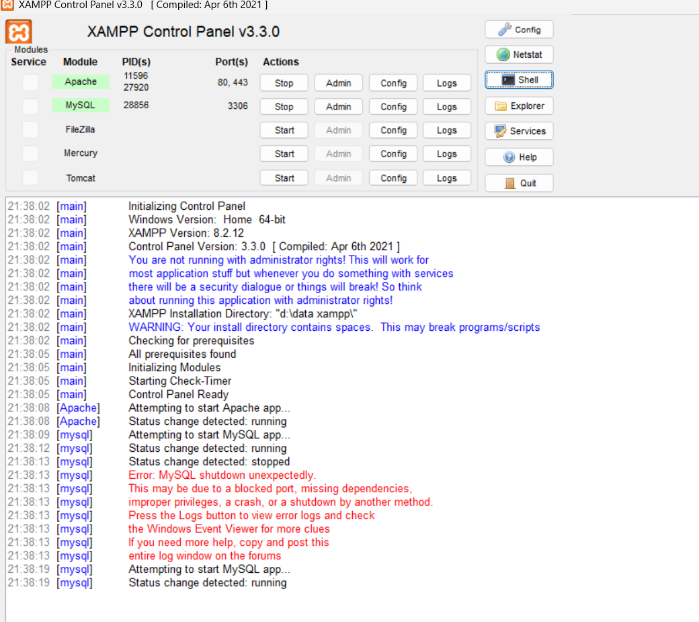
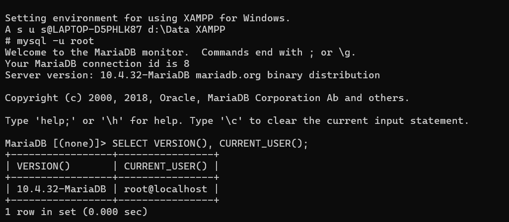
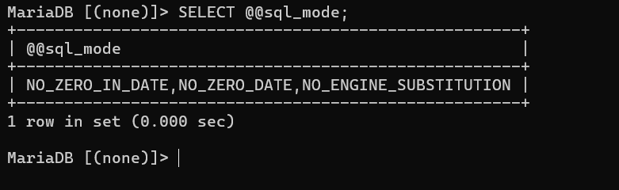
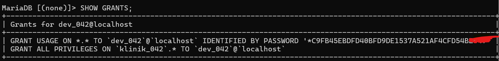
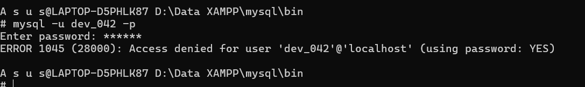
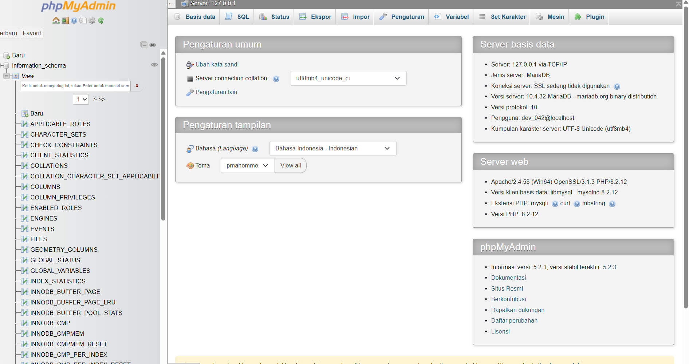

# Laporan Praktikum Basis Data - Pertemuan 01

Nama: ADAM MAULANA FIRMANSYAH
NPM: 25430042
Kelas:B
Tanggal: 06 Oktober 2026
Asisten/Dosen: Dedi Irawan S.Kom, M.Kom

## 1. Tujuan Praktikum

tujuan praktikum modul 1 ini adalah untuk menjalankan dan menghentikan sever MariaDB menggunakan XAMPP control serta membaca status dan portnya. terhubung ke server melalui CLI dan phpMyAdmin, membuat akun root dan mengamankannya dengan password, membuat akun kerja yang mempunyai hak terbatas. membuat sebuah basisdata yang ke repositori git yang terhubung ke github langsung.

## 2. Ringkasan Dasar Teori
MariaDB merupakan sistem manajemen basis data yang bekerja dengan model client-server. MariaDB server menerima perintah dari client, misalnya program mysql di terminal atau phpMyAdmin. Setelah perintah diproses, hasil atau pesan error dikembalikan kepada client.

Dalam MariaDB, akun pengguna tidak hanya ditentukan oleh nama user, tetapi juga oleh host. Contohnya adalah dev_042@localhost. Karena itu, satu nama pengguna dapat memiliki hak akses yang berbeda apabila host-nya berbeda.

Pengaturan hak akses digunakan untuk membatasi apa saja yang dapat dilakukan oleh suatu akun. Pada praktikum ini digunakan prinsip least privilege, yaitu akun kerja tidak diberi hak yang lebih besar dari yang dibutuhkan.

Git digunakan untuk mencatat perubahan file dalam bentuk commit. GitHub digunakan sebagai tempat menyimpan repositori sehingga hasil pekerjaan dapat dilihat dan riwayat perubahan dapat dilacak.

## 3. Hasil Langkah Percobaan
### 3.1 Menjalankan MariaDB melalui XAMPP

MariaDB dijalankan melalui` XAMPP Control Panel`. Setelah layanan berjalan, MariaDB dapat menerima koneksi dari client.
Pada tahap ini saya memastikan layanan database dapat digunakan sebelum melanjutkan ke langkah berikutnya.

### 3.2 Masuk ke MariaDB melalui CLI
Saya masuk ke MariaDB menggunakan terminal melalui `XAMPP Shell`. Setelah prompt MariaDB `[(none)]>` muncul, berarti koneksi ke server sudah berhasil.

Saya kemudian menjalankan:
`SELECT VERSION(), CURRENT_USER();`

Hasilnya menunjukkan:
Versi MariaDB: `10.4.32-MariaDB`
User: `dev_042@localhost`
Hasil ini digunakan untuk memastikan versi server dan akun yang sedang digunakan.

### 3.3 Memeriksa SQL Mode
saya menjalankan
SELECT @@sql_mode;
Hasil yang diperoleh adalah:
`STRICT_TRANS_TABLES,ERROR_FOR_DIVISION_BY_ZERO,NO_AUTO_CREATE_USER,NO_ENGINE_SUBSTITUTION`
Dari hasil tersebut terlihat bahwa `STRICT_TRANS_TABLES` aktif. Mode ini berguna untuk membuat server lebih ketat dalam menangani data yang tidak sesuai.

### 3.4 Membuat Basis Data Latihan dan Akun Kerja
Saya membuat basis data latihan `kopma_042` dan akun `mhs_042` untuk digunakan pada bagian latihan.

Akun tersebut kemudian diberikan hak akses pada basis data `kopma_042`.

### 3.5 Membuat Basis Data Proyek
Sesuai tema proyek, saya menggunakan tema klinik.

Basis data proyek yang dibuat adalah:

**klinik_042**

Basis data tersebut menggunakan:

`Character set: utf8mb4`
`Collation: utf8mb4_unicode_ci`
Penggunaan nama KLINIK_042 disesuaikan dengan tema proyek dan tiga digit terakhir NIM saya.

### 3.6 Membuat Akun Proyek
Akun proyek yang digunakan adalah:

`dev_042@localhost`

Akun ini dibuat khusus untuk kebutuhan proyek.
### 3.7 Memberikan Hak Akses
Akun dev_042 diberikan hak akses pada basis data:

`klinik_042`

Saya kemudian memeriksa hak akses tersebut dengan:

`SHOW GRANTS;`

Hasilnya menunjukkan bahwa `dev_042` mempunyai hak akses pada `klinik_042`

### 3.8 Menguji Batas Hak Akses
Untuk memastikan pembatasan hak akses benar-benar bekerja, saya mencoba membuka basis data latihan menggunakan akun proyek.

Perintah yang digunakan:

`USE kopma_042;`

Hasilnya:

`ERROR 1044`

Artinya akun `dev_042` berhasil dikenali oleh MariaDB, tetapi tidak diberikan izin untuk membuka basis data kopma_042.

Saya juga mencoba:

`SELECT * FROM mysql.user;`

Hasilnya:

`ERROR 1142`

Artinya akun dev_042 tidak memiliki izin untuk menjalankan perintah SELECT pada tabel mysql.user.

### 3.9 Pengujian Autentikasi
Saya melakukan pengujian login dengan password yang tidak sesuai. Hasil yang muncul adalah:

ERROR 1045

Dari percobaan tersebut saya dapat melihat bahwa ERROR 1045 berkaitan dengan proses autentikasi atau login.

### 3.10 Konfigurasi phpMyAdmin
Pada awalnya phpMyAdmin masih menggunakan konfigurasi login otomatis. Setelah akun root diberi password, konfigurasi tersebut menyebabkan koneksi ditolak.

Saya kemudian mengubah `auth_type` pada `config.inc.php` menjadi:
`cookie`

Setelah itu phpMyAdmin menampilkan halaman login sehingga username dan password dapat dimasukkan secara langsung.

Saya berhasil masuk menggunakan akun dev_042 dan dapat melihat basis data proyek klinik_042.

### 3.11 Menyimpan Pekerjaan ke GitHub
Repositori proyek yang digunakan adalah:
Berkas utama yang sudah ditambahkan :
* .gitignore
* README.md
* p01_lingkungan_25430042.sql
* laporan/p01_laporan_25430042.md
* laporan/image/

Commit yang dibuat pada Pertemuan 1 antara lain:
* p01: tambah gitignore
* p01: tambah skrip lingkungan
* p01: tambah bukti git push
* p01: tambah laporan praktikum
* p01: tambah folder bukti
* p01: tambah bukti show grants
* p01: tambah bukti error 1045
* p01: tambah bukti phpmyadmin dev_042
* p01: rapikan laporan
* p01: rapikan bukti laporan

ini membuat pekerjaan pada Pertemuan 1 memiliki riwayat perubahan yang jelas.

## 4. Jawaban Titik Analisis
### Titik Analisis 1
Walaupun tombol yang digunakan pada `XAMPP` bertuliskan `MySQL`, server yang digunakan dalam praktikum ini adalah MariaDB. Karena itu, saat mencari solusi di internet saya harus memperhatikan apakah contoh tersebut cocok untuk MariaDB atau hanya untuk `MySQL`.

Dokumentasi MySQL masih bisa membantu pada bagian yang kompatibel, tetapi untuk hal yang spesifik sebaiknya saya memeriksa dokumentasi MariaDB

### Titik Analisis 2
Setelah root diberi password, saya mencoba login tanpa memberikan password dan muncul ERROR 1045. Dari situ saya memahami bahwa ERROR 1045 berhubungan dengan proses login, misalnya password yang dimasukkan salah atau password tidak diberikan.

Berbeda dengan `ERROR 1044`. Pada `ERROR 1044`, user sudah berhasil login tetapi mencoba membuka database yang memang tidak diberikan hak akses. Hal tersebut saya buktikan ketika akun dev_042 mencoba masuk ke `kopma_042`.

Saya juga menemukan `ERROR 1142` saat akun `dev_042` mencoba menjalankan perintah pada tabel sistem yang tidak menjadi haknya. Jadi dari percobaan tersebut saya bisa membedakan bahwa ERROR 1045 berkaitan dengan login, `ERROR 1044` berkaitan dengan akses ke database, sedangkan ERROR 1142 berkaitan dengan izin menjalankan perintah pada objek atau tabel tertentu.

###  Titik Analisis 3
information_schema tetap dapat terlihat oleh akun kerja karena berisi informasi tentang objek-objek database. Sebaliknya, database seperti mysql tidak bisa dibuka oleh akun kerja apabila akun tersebut tidak mempunyai hak akses.

Pada percobaan saya, akun `dev_042` masih dapat melihat `information_schema` dan `Klinik_042`. Namun ketika saya mencoba `USE kopma_042`, `MariaDB` menampilkan `ERROR 1044` karena akun tersebut tidak diberikan akses ke database tersebut.

### Titik Analisis 4
Mode cookie pada phpMyAdmin lebih aman dibandingkan konfigurasi login otomatis karena pengguna diminta memasukkan username dan password pada halaman login. Password tidak perlu ditulis langsung pada konfigurasi koneksi.

### 5 Hasil Latihan Dan Modifikasi
Pada bagian latihan saya melakukan pengujian hak akses dan autentikasi untuk melihat respon MariaDB terhadap kondisi yang berbeda.

Hasil pengujian menunjukkan bahwa akun dengan hak akses terbatas memang tidak dapat membuka database yang tidak diberikan izin. Selain itu, akun tersebut juga tidak dapat membaca tabel sistem yang tidak menjadi haknya.

Saya juga menguji penggunaan `skrip SQL` dengan konsep `IF NOT EXISTS` agar pembuatan database dan akun dapat dilakukan kembali tanpa menimbulkan error karena objek sudah ada.

### 6 Tugas Mandiri: Milestone Proyek 1
Identitas proyek:
* Nama Organisai Fiktif: `BUNDA SEHAT`
* Tema:`Klinik`
* Basis Data Proyek:`Klinik_042`
* Akun Proyek: `dev_042`
Akun `dev_042` diberikan hak akses pada `klinik_042`
Saya kemudian melakukan pengujian dengan mencoba membuka `kopma_042` menggunakan akun `dev_042`. Hasilnya muncul `ERROR 1044`. Dari pengujian tersebut dapat dibuktikan bahwa akun proyek tidak diberikan akses ke database latihan.

Repositori proyek:

### 7. Pembahasan dan Kendala
`Kendala 1:` `sql_mode` tidak memuat` STRICT_TRANS_TABLES`. kendala `sql_mode` tidak memuat dikarenakan `sql_mode` itu ada dua baris di `my`.ini dan saya lalu menambahkan tagar ke satunya. setelah itu di cek ulang dan berhasil

`Kendala 2`: salah ketik pada perintah SQL. jika aku salah ketik maka akan mucul seperti ini `(ERROR 1064 (42000)`: You have an error in your SQL syntax; check the manual that corresponds to your `MariaDB server version for the right syntax to use near 'CRETAE USER 'dev_0420'@'localhost' IDENTIFIED BY 'dev42`'' `at line 1`
### 8. Kesimpulan
Praktikum Pertemuan 1 berhasil membantu saya menyiapkan lingkungan kerja `MariaDB` menggunakan `XAMPP`, membuat akun pengguna, membuat database proyek, dan mengatur hak akses.

Saya juga berhasil membuat database `klinik_042` dan akun `dev_042`, kemudian membuktikan bahwa akun tersebut tidak dapat membuka `kopma_042`. Selain itu, pekerjaan praktikum sudah mulai dicatat di GitHub agar perubahan proyek dapat dilacak

### 9. Pernyataan Penggunaan AI
Saya menggunakan AI sebagai alat bantu untuk memahami materi, menjelaskan perintah `MariaDB`, membaca pesan `error`, memahami struktur `Git` dan `GitHub`, serta membantu merapikan penjelasan pada laporan

### 10. Bukti Git
Repositori:
`https://github.com/adam25430042/basisdata_adam-25430042`
Commit Pertemuan 1:

* p01: tambah gitignore
* p01: tambah skrip lingkungan

Bukti commit dan isi repositori disimpan pada GitHub.

## Checklist

- [x] p01_lingkungan_25430042.sql
- [x] README.md berisi Identitas Proyek
- [x] .gitignore
- [x] SELECT VERSION(), CURRENT_USER();
- [x] SELECT @@sql_mode;
- [x] SHOW DATABASES sebagai dev_042
- [x] SHOW DATABASES sebagai mhs_042
- [x] Bukti ERROR 1044
- [x] Bukti ERROR 1142
- [x] Halaman masuk phpMyAdmin mode cookie
- [x] GitHub dan commit
- [x] Analisis perbedaan ERROR 1044, 1045, dan 1142